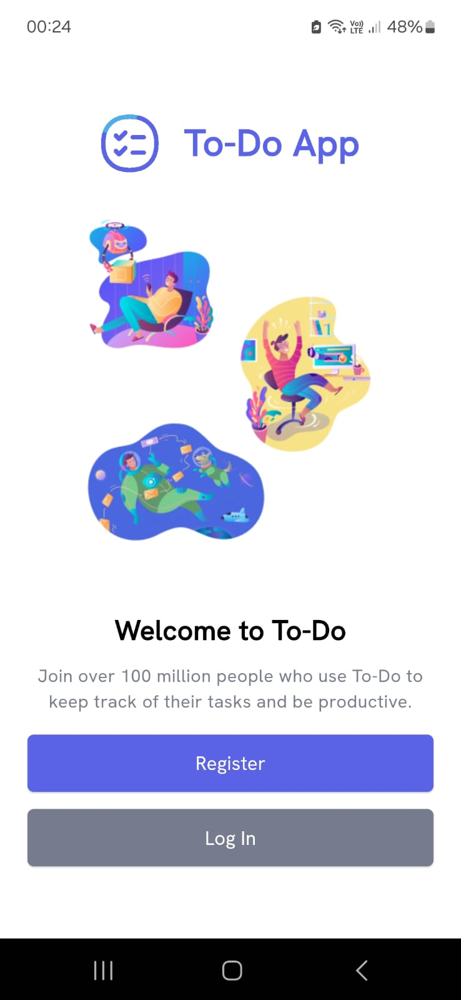
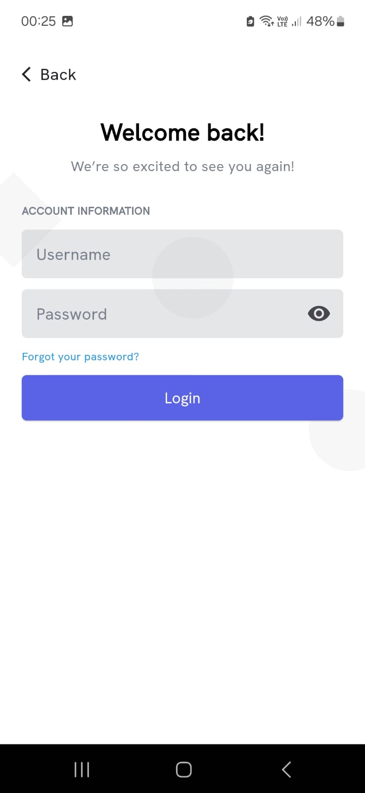
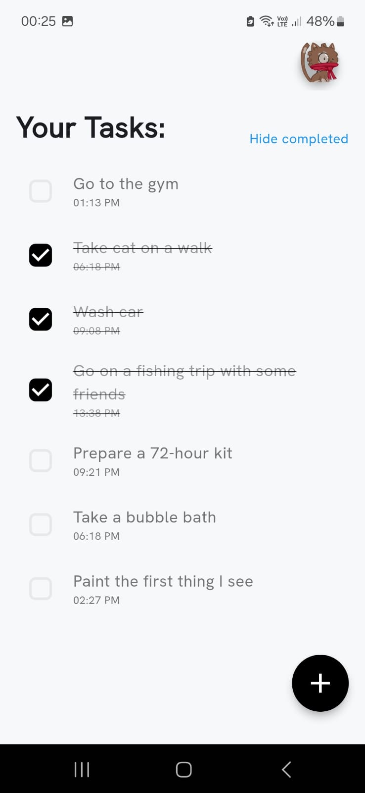
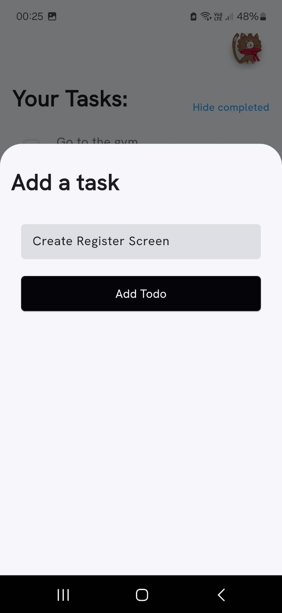
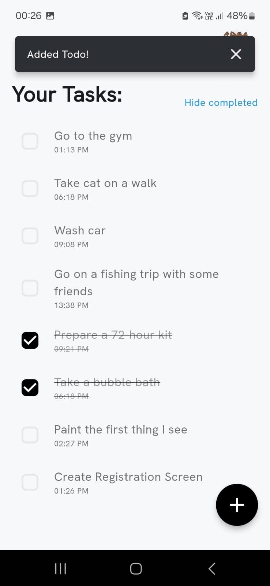

# Flutter Todo App

This Flutter application provides a login screen and a todo screen to manage tasks for authenticated users.


## Overview

The app utilizes two Dummy API endpoints (dummyjson) for its functionality:
- **Authentication API Endpoint:** Used for user login and authentication. Endpoint: [Authentication API](https://dummyjson.com/docs/auth)
- **Todo API Endpoint:** Fetches user-specific tasks. Endpoint: [Todo API](https://dummyjson.com/docs/todos)

The application fetches user-specific tasks upon successful authentication and displays them in an intuitive interface.


## Installation and Usage

1. Clone the repository:

   ```bash
   git clone https://github.com/yourusername/flutter-todo-app.git
   ```

2. Navigate to the project directory:

   ```bash
   cd flutter-todo-app
   ```

3. Install dependencies:

   ```bash
   flutter pub get
   ```

4. Run the Application using USB Debugging or on an Emulator

   ```bash
   flutter run
   ```


## Pages and Screenshots

<details>
<summary> Hero Screen </summary>



</details>

<details>
<summary> Login Screen </summary> 




</details>

<details>
<summary> Todo Screen </summary> 






</details>

---